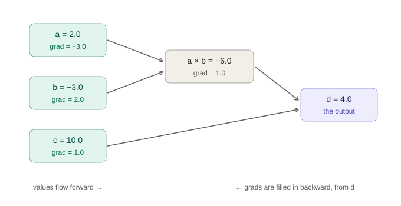
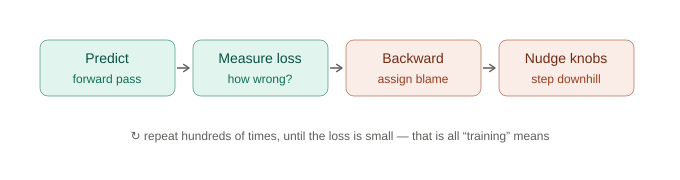
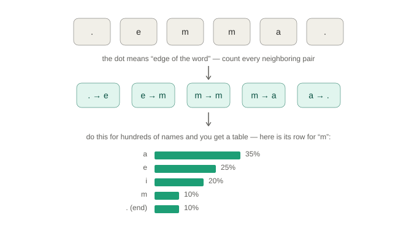
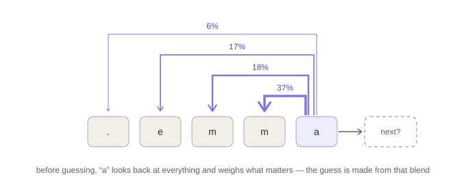

# What I learned building a (tiny) GPT from scratch

I'm a security data analyst, two years into the field, and until recently I used
AI tools all day without being able to explain how they work. So I built one —
from nothing. No PyTorch, no tutorials copy-pasted on faith. Every piece
hand-written, tested, and shipped as a pull request in this repo.

This is the plain-English version of what I found. If you can follow a recipe,
you can follow this.

## The whole thing in one sentence

A neural network is a machine with thousands of adjustable dials that tunes
itself: it makes a guess, measures how wrong it was, works out which dials to
blame, moves each one a hair, and repeats — thousands of times.

Everything below is that sentence, unpacked.

## Step 1: a number that remembers (the autograd engine)

The foundation is embarrassingly small — about 100 lines of Python. A `Value`
is a number that remembers how it was made. Do math with Values and they
quietly record every operation. Ask the final result to walk its history
backwards, and every ingredient learns its **blame**: *how much would the
answer move if I nudged this number a tiny bit?*

That backwards walk is called **backpropagation**, and it is the single
mechanism underneath every neural network in existence, including the ones
writing emails and code today. I verified mine with what I call the lie
detector: nudge an input by 0.000001, re-run everything for real, and check the
measured slope matches what the engine claimed. It matches to many decimal
places, every time.

## Step 2: the learning loop

A **neuron** is a handful of those blame-tracking numbers: multiply the inputs
by weights, add them up, squash the result. Stack neurons into layers and you
have a guessing machine whose dials start random — it begins life guessing
garbage.

Then you run one loop, forever:

I trained a 37-dial network on XOR ("say yes when exactly one input is on") —
the classic problem no single straight-line rule can solve. Total wrongness
fell from 4.30 to 0.002 and all four answers came out right. Nobody told the
network the rule. **It was only ever told how wrong it was.** The rule emerged
from wrongness plus nudges, which is the genuinely strange fact at the bottom
of all of this.

## Step 3: language is just "guess what comes next"

A language model has one job: predict the next thing. My first one was a
lookup table — count which letter follows which across 500 names, and you can
*invent* names by rolling weighted dice down the table.

Two lessons came out of this step. First, the loss for language is
**surprise**: how shocked is the model, on average, by each real letter?
Guessing blindly over 27 characters scores 3.30; my table scored 2.33 — an
honest, numeric proof it learned something about English spelling.

Second, a bug: my tests all passed while the model produced garbage like
*gzongssa*. The smoothing (pretend counts that stop anything being "impossible")
was drowning my small dataset in noise. **Every score said fine; the actual
output said broken.** Tests check what you thought to check. Looking at real
output catches what you didn't.

## Step 4: attention — the model learns to look back

The table's fatal flaw: it remembers exactly one letter. It types *ttte*
because it can't know it already typed two t's. **Attention** is the fix, and
it's the idea that turned language models into GPT: at every position, the
model looks back over everything earlier and weighs which characters matter
*right now* — and those weights are learned, by the same blame-and-nudge loop.

Each position broadcasts a question ("who has info about endings?") and a
résumé ("I'm an m at position 3"); strong matches get attention, and the
matched positions contribute what they know. One rule keeps it honest: no
position may look at the *future* — that would be reading the answer key. I
test that literally: change a later character, assert earlier predictions
don't move by one bit.

## The scoreboard

Three generations of model, one yardstick, same 500 names:

| model | remembers | surprise (lower = better) |
|---|---|---|
| blind guessing | nothing | 3.30 |
| bigram table | 1 character | 2.33 |
| tiny GPT (8,400 dials) | 8 characters, weighted | **1.98** |

And you can see it in the output: the table invented *ttte*; the tiny GPT
invented *jasmer*, *rayson*, and *livianiel*.

## The part that changed how I see AI tools

The architecture I built — embeddings, attention, a think-it-over layer,
next-token scores, trained to minimize surprise — **is GPT.** Scale 8,400
dials to billions, 8 characters of context to thousands of words, one
attention head to dozens stacked deep, and the mechanism does not change.

Which also means: a trained model is nothing but its dial values. Mine fits in
a 67 KB file. The "temperature" setting in every AI tool is just a dial that
reshapes the dice before each roll — low temperature plays the favorite, high
temperature gives underdogs a chance. These stopped being mysteries the day I
built them.

## What's next

This repo's phase 2 points all of it at my actual field: an LLM phishing-email
classifier, scored honestly against a dumb keyword baseline. Phase 3 attacks
my own classifier with prompt injection, then defends it — because a security
analyst who has personally built, measured, broken, and fixed an LLM system is
a different kind of analyst.

If you're curious, every step is a merged PR with tests and a diagram. Start
at PR #1.
